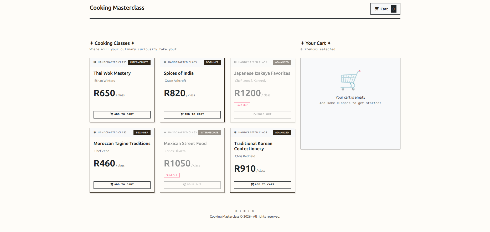

# Cooking Masterclass - Shopping Cart Prototype

A Vue.js shopping cart prototype for Cooking Masterclass that allows users to browse cooking classes, add items to a cart, adjust quantities, and view live pricing totals.



## Features

- Browse cooking classes with chef names, prices, and skill levels
- Add available classes to shopping cart
- Adjust quantities with increment/decrement controls
- Remove items from cart with one click
- Live price updates (line totals, subtotal, and grand total)
- Sold out classes displayed with disabled add to cart button
- Cart data persists on page refresh using localStorage
- Responsive two-column layout (stacks on mobile)

## Tech Stack

- Vue.js 3
- LocalStorage API
- Bootstrap 5
- HTML5/CSS3
- Vite (build tool)

## Project Structure

```bash
src/
├── assets/
│   └── main.css
├── components/
│   ├── Header.vue
│   ├── CourseCatalog.vue
│   ├── CourseCard.vue
│   ├── ShoppingCart.vue
│   ├── CartItem.vue
│   ├── CartSummary.vue
│   └── Footer.vue
├── composables/
│   └── courses.js
├── App.vue
└── main.js
```

## Installation & Setup

1. **Clone the repository**

```bash

# Clone the repository

git clone https://github.com/your-username/LCA-VueJS-Exercises.git

# Navigate to project folder

cd LCA-VueJS-Exercises

# Install dependencies

npm install

# Run development server

npm run dev

```
